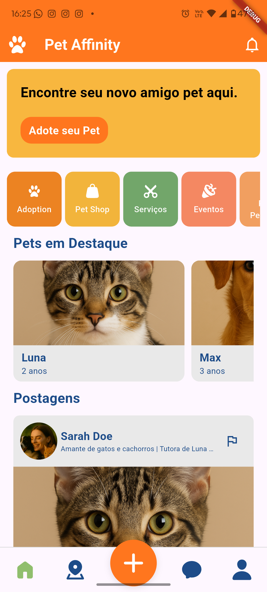
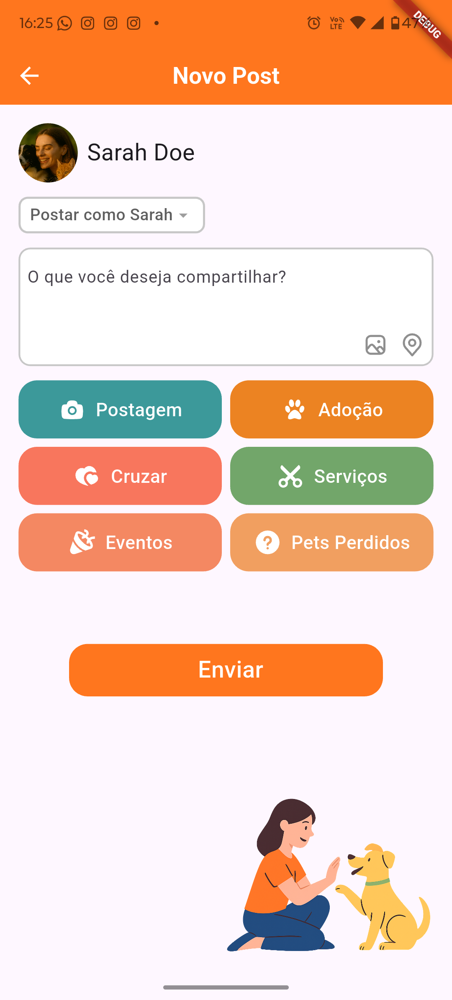
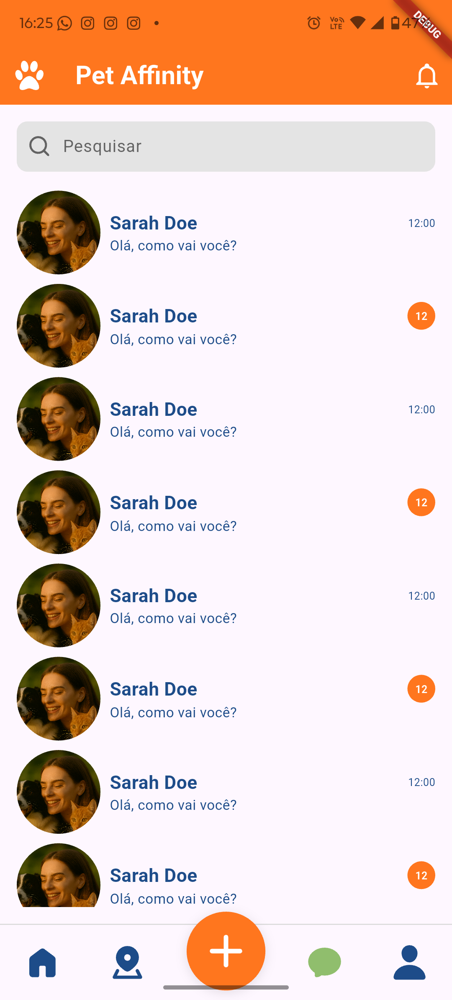
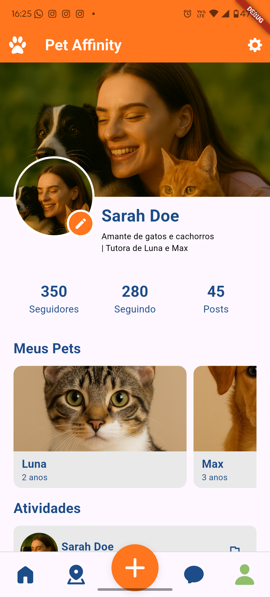

<h1 align="center">🐾 Pet Affinity</h1>

  A social network for pet lovers — built with Flutter, MobX, GetIt, and Dio. 
  Modular architecture inspired by the Pokedex project structure.

<h2>✨ Overview</h2>

  Pet Affinity is a Flutter application designed as a community platform for pet owners.
  Users can browse posts, create new content, chat in real time, and manage their profile.
  The project follows a clean, modular architecture using the MVVM pattern combined with MobX 
  for state management, GetIt for dependency injection, and Dio for networking.

<h2>🧱 Project Structure</h2>

<pre>
lib/
│
├── core/
│   ├── enums/
│   ├── models/
│   ├── network/        → Dio client configuration
│   ├── repository/     → Abstract + implementation using Dio
│   ├── services/       → Business logic + GetIt service locator
│
├── modules/
│   ├── home/
│   │   ├── view/
│   │   └── view_model/
│   ├── post/
│   │   ├── view/
│   │   └── view_model/
│   ├── chats/
│   │   ├── view/
│   │   └── view_model/
│   ├── profile/
│       ├── view/
│       └── view_model/
│
├── shared/
│   ├── widgets/
│   ├── styles/
│   └── utils/
│
└── main.dart
</pre>

<h2>⚙️ Tech Stack</h2>

<ul>
  <li><strong>Flutter</strong> — Cross-platform UI</li>
  <li><strong>MobX</strong> — Reactive state management</li>
  <li><strong>GetIt</strong> — Clean dependency injection</li>
  <li><strong>Dio</strong> — REST API client</li>
  <li><strong>MVVM Architecture</strong> — Separation of concerns</li>
</ul>

<h2>🚀 Getting Started</h2>

<h4>Clone the repository:</h4>

<pre>
git clone https://github.com/Romulo1209/Pet-Affinity.git
cd pet_affinity
</pre>

<h4>Install dependencies:</h4>

<pre>
flutter pub get
</pre>

<h4>Run the app:</h4>

<pre>
flutter run
</pre>

<h2>📸 Screenshots</h2>

Add your 4 screens after uploading them to your repo.

<h3>🏠 Home</h3>

  

<h3>📝 New Post</h3>

  

<h3>💬 Chats</h3>

  

<h3>👤 Profile</h3>

  

<h2>🧠 Architecture</h2>

  Pet Affinity uses a modular MVVM approach. Each module contains:

<ul>
  <li><strong>View</strong> (UI widgets)</li>
  <li><strong>ViewModel</strong> (MobX store)</li>
  <li><strong>Service or Repository</strong> if needed</li>
</ul>

<h3>🧩 Example — MobX Store</h3>

<pre>
class HomeStore = _HomeStoreBase with _$HomeStore;

abstract class _HomeStoreBase with Store {
  final postService = GetIt.I.get<PostService>();

  @observable
  ObservableList<PostModel> posts = ObservableList.of([]);

  @action
  Future<void> loadPosts() async {
    posts = ObservableList.of(await postService.getAll());
  }
}
</pre>

<h3>🌐 Example — Dio Client</h3>

<pre>
class DioClient {
  final Dio dio = Dio(BaseOptions(
    baseUrl: "https://api.petaffinity.com",
    connectTimeout: const Duration(seconds: 15),
  ));
}
</pre>

<h2>📌 Roadmap</h2>

<ul>
  <li>[ ] Notifications</li>
  <li>[ ] Real-time chat (WebSockets)</li>
  <li>[ ] Pet adoption matching system</li>
  <li>[ ] Media editing tools</li>
</ul>

